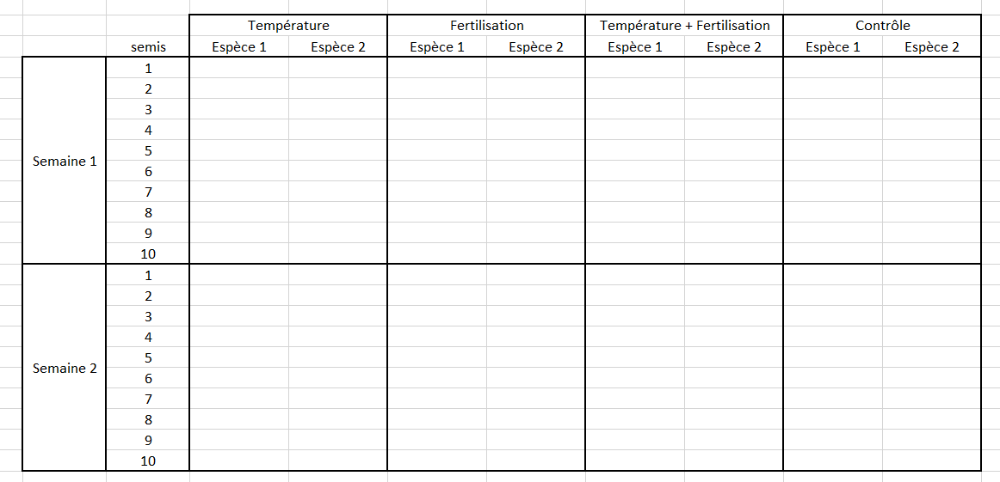
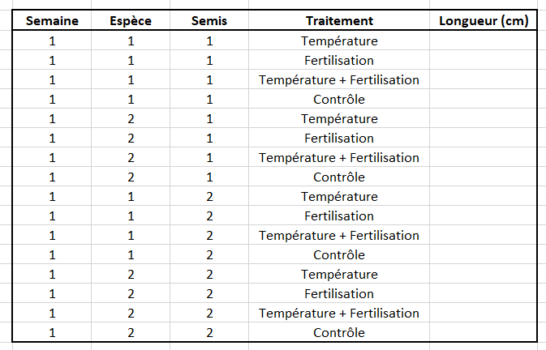

```{r setup, include=FALSE}
knitr::opts_chunk$set(echo = FALSE)
```

*Ce tutoriel est adapté de [Basic data manipulation](https://ourcodingclub.github.io/tutorials/data-manip-intro/index.html) et [Efficient data manipulation](https://ourcodingclub.github.io/tutorials/data-manip-efficient/) du site [Our Coding Club](https://ourcodingclub.github.io/).* 

# Introduction

```{r, layout="l-body"}
knitr::include_graphics("img/data_cowboy.png")
```
Dessin de [Allison Horst](https://raw.githubusercontent.com/allisonhorst/stats-illustrations/master/rstats-artwork/data_cowboy.png)

<br>

Les formats de nos données peuvent varier, et un format utile et pratique dans un cas précis ne le sera pas forcément dans un autre. La **maîtrise des outils de manipulation et de mise en forme des données** est donc essentielle !

<br>

Voici le sommaire de ce tutoriel :  

<br>

**1. [Manipuler des données avec *dplyr*](#dplyr)** : [renommer des variables](#rename), [sélectionner des colonnes](#select), [filtrer des données](#filter), [trier des données](#arrange), [créer de nouvelles colonnes](#mutate), [définir des groupes](#groupby), [calculer des statistiques](#summarise), [joindre des données](#join)  

**2. [Mettre en forme des données avec *tidyr*](#tidyr)** : [format long](#pivotlonger), [format large](#pivotlarger)  

**3. [Défi](#defi)**

<br>

Vous pouvez revoir les bases de R et RStudio dans le tutoriel **[Premiers pas avec R](https://codons.netlify.app/posts/premiers-pas-avec-r/)**.

<br>

## Le Tidyverse

Le [**Tidyverse**](https://www.tidyverse.org/) est un ensemble de packages permettant notamment d'**importer des données (*readr*)**, de les **manipuler (*dplyr*)**, de les **mettre en forme (*tidyr*)**, de créer des **graphiques (*ggplot2*)**, de **manipuler des chaînes de caractères (*stringr*)**, de **rédiger des rapports (*rmarkdown*)**, ...

```{r, layout="l-body"}
knitr::include_graphics("img/tidyverse_celestial.png")
```
Dessin de [Allison Horst](https://github.com/allisonhorst/stats-illustrations/blob/master/rstats-artwork/tidyverse_celestial.png)

<br>

Commençons par **installer la suite Tidyverse** (nous pourrions également installer séparément les packages que nous allons utiliser, `dplyr` et `tidyr`) : 

```{r, echo=TRUE, eval=FALSE}
# Installer le Tidyverse
install.packages("tidyverse")
```

<br>

# Manipuler des données avec `dplyr` {#dplyr}

Les fonctions du package [`dplyr`](https://dplyr.tidyverse.org/) sont **nommées d'après l'action qu'elles accomplissent**, ce qui rend leur utilisation assez intuitive.

Nous allons utiliser un jeu de données contenant des mesures de croissance annuelle de tiges d'arbrisseaux qui poussent dans des dunes de sable ([*Empetrum nigrum*](https://fr.wikipedia.org/wiki/Empetrum_nigrum) ou camarine noire). La distance à la mer de chaque individu est codée dans la variable catégorique "zone" : le chiffre 2 représente la zone la plus proche de la mer et le chiffre 7 la zone la plus éloignée de la mer.

La fonction `read_csv()` permet d'importer un fichier `.csv` depuis une page web : 

```{r, echo=TRUE, eval=FALSE}
# Ateliers codons!
# 02 - Manipulation de donnees
# Lundi 30/05/2022

# Charger le Tidyverse ----

library(tidyverse)

# Definir le repertoire de travail ----

setwd("C-02-ManipulationDonnees")

# Importer les donnees ----

croissance <- read_csv("https://raw.githubusercontent.com/codons-blog/C-02-ManipulationDonneesBases/main/croissance.csv")
```

<br>

Il est toujours utile de **visualiser nos données** et leur structure : 

```{r, echo=TRUE, eval=FALSE}
# Exploration rapide des donnees ----

head(croissance)  # affiche les premieres lignes
str(croissance)  # types des variables
unique(croissance$Zone)  # affiche les valeurs distinctes de la variable Zone
croissance$Indiv  # affiche toutes les valeurs de la variable Indiv
length(unique(croissance$Indiv))  # affiche le nombre d'individus

```

<br>

Lorsque vous exécutez la commande `head(croissance)`, vous pouvez remarquer dans la console la mention "A tibble". Un [**tibble**](https://tibble.tidyverse.org/index.html) est un format particulier de tableau utilisé par le Tidyverse. Il présente notamment l'avantage d'afficher les **types de variables** sous les noms de colonnes. 

<br>

## Renommer des variables avec `rename()` {#rename}

Cette fonction s'utilise de la façon suivante : `rename(objet, nouveau_nom = ancien_nom)`.

```{r, echo=TRUE, eval=FALSE}
# Supprimer les majuscules dans les noms de colonnes
croissance <- rename(croissance,
                      zone = Zone,
                      indiv = Indiv)
```

<br>
Avant d'aller plus loin, nous allons voir une fonctionnalité extrêmement pratique : **le "pipe"**. Un pipe permet d'enchaîner les opérations, et présente plusieurs avantages, notamment de rendre le **code plus clair et lisible** et de rendre possible l'**auto-complétion** (à l'aide de la touche `Tab`).  

Le pipe fait partie du package [`magrittr`](https://magrittr.tidyverse.org/), inclus dans le Tidyverse.  

Un pipe se place à la fin d'un ligne sous la forme `%>%` : 

<aside>
Raccourci clavier : `Ctrl + Shift + M`
</aside>

```{r, echo=TRUE, eval=FALSE}
croissance <- croissance %>% 
  rename(zone = Zone,
         indiv = Indiv)
```

<br>

## Sélectionner des colonnes avec `select()` {#select}

Cette fonction permet de sélectionner des colonnes, en précisant lesquelles conserver ou supprimer : 

```{r, echo=TRUE, eval=FALSE}
# Conserver des colonnes

croissance_selection <- croissance %>% 
  select(indiv, `2007`:`2012`)

# Supprimer une colonne

croissance_selection <- croissance %>% 
  select(-zone)

```

<br>

La fonction `select()` permet également de **renommer des colonnes** et d'**en modifier l'ordre** : 

```{r, echo=TRUE, eval=FALSE}
# Renommer et modifier l'ordre de colonnes

croissance_selection <- croissance %>% 
  select(zone = Zone, indiv = Indiv, `2007`:`2012`)
```

<br>

L'opérateur `:` permet de construire une **séquence** : dans le cas présent il permet de sélectionner toutes les colonnes entre 2007 et 2012.  

Si vous souhaitez renommer ou déplacer seulement quelques colonnes, la fonction `everything()` vous permet de **sélectionner toutes les colonnes restantes** : 

```{r, echo=TRUE, eval=FALSE}
croissance2_selection <- croissance %>% 
  select(zone = Zone, indiv = Indiv, everything())
```

<br>

## Filtrer des données avec `filter()` {#filter}

Cette fonction permet de sélectionner des lignes à l'aide d'**opérateurs logiques** : 

Opérateur   Expression logique
----------  -------------------
==          strictement égal à
<=          inférieur ou égal à
<           inférieur à
>=          supérieur ou égal à
>           supérieur à
!=          différent de
%in%        appartient à
&           et
|           ou
!           pas  

Voyons comment utiliser ces opérateurs logiques : 

```{r, echo=TRUE, eval=FALSE}
# individu n°603

croissance %>% filter(indiv == 603)

# zones 2, 3 et 4

croissance %>% filter(zone <= 4)
croissance %>% filter(zone %in% c(2, 3, 4))
croissance %>% filter(zone %in% 2:4)
croissance %>% filter(!zone >= 5)

# zones 2 et 7

croissance2 %>% filter(zone == 2 | zone == 7)
croissance2 %>% filter(zone %in% c(2, 7))

# zone 2 + individus entre 300 et 400

croissance %>% filter(zone == 2 & indiv %in% 300:400)
croissance %>% filter(zone == 2 & between(indiv, 300, 400))
```

<br>

Il existe différentes façons de **construire une séquence** :

```{r, echo=TRUE, eval=FALSE}
seq(from = 300, to = 400, by = 10)  # de 300 a 400 avec un increment de 10
rep(x = c(300, 350), times = 2)  # 2 repetitions du vecteur "300, 350"
rep(x = c(300, 350), each = 2)  # chaque element du vecteur "300, 350" est repete 2 fois
rep(seq(from = 300, to = 400, by = 10), times = 4)  # combinaison des deux
```

<br>

## Trier des données avec `arrange()` {#arrange}

La fonction `arrange()` permet de trier des valeurs par **ordre croissant ou décroissant** : 

```{r, echo=TRUE, eval=FALSE}
# Trier par ordre croissant sur l'annee 2007

croissance %>% arrange(`2007`)

# Trier par ordre decroissant sur l'annee 2008

croissance %>% arrange(desc(`2008`))
```

<br>

## Créer de nouvelles colonnes avec `mutate()` {#mutate}

La fonction `mutate()` permet de créer un nouvelle colonne :

```{r, echo=TRUE, eval=FALSE}
# Calculer la croissance totale pour chaque individu entre 2007 et 2012

croissance_totale <- croissance2 %>% 
  mutate(croissance.totale = `2007` + `2008` + `2009` + `2010` + `2011` + `2012`)
```

<br>

## Définir des groupes avec `group_by()` {#groupby}

Cette fonction permet de créer une **structure interne à vos données**, par exemple des individus regroupés par zone. Les fonctions exécutées après l'appel à la fonction `group_by()` tiendront compte de cette structure interne. L'utilisation de la fonction `group_by()` associée à d'autres fonctions est très utile pour calculer des statistiques pour différents sites, traitements, espèces, ...
 
```{r, echo=TRUE, eval=FALSE}
# Grouper les individus par zone

croissance_groupes <- croissance %>% 
  group_by(zone)
```

<br>

Comparez les deux objets `croissance2` et `croissance2_groupes`. La seule différence visible est la mention `Groups` quand vous affichez l'objet possédant une structure interne. Pour l'instant, les groupes créés par `group_by()` sont **sous-jacents**, et leur intérêt sera évident en appliquant d'autres fonctions à ces groupes.

<br>

## Agréger des lignes et calculer des statistiques avec `summarise()` {#summarise}

Cette fonction permet d'agréger des lignes en appliquant une fonction sur une ou plusieurs colonnes :

```{r, echo=TRUE, eval=FALSE}
# Croissance totale pour l'ensemble des individus pour l'annee 2007

synthese1 <- croissance %>% 
  summarise(croissance.totale.2007 = sum(`2007`))

# Croissance totale pour l'ensemble des individus groupes par zone pour l'annee 2007

synthese2 <- croissance_groupes %>% 
  summarise(croissance.totale.2007 = sum(`2007`))
```

<br>

Le premier objet, `synthese1`, correspond à la somme de toutes les valeurs de croissance pour tous les individus en 2007.
Le second objet, `synthese2`, correspond à la somme des valeurs de croissance pour les individus regroupés par zone en 2007.

<aside>
Les données étant agrégées, le tableau de sortie sera plus court que les données d'origine.
</aside>

Vous pouvez de cette façon calculer plusieurs paramètres : 

```{r, echo=TRUE, eval=FALSE}
synthese3 <- croissance_groupes %>% 
  summarise(croissance.totale.2007 = sum(`2007`),
            croissance.moyenne.2007 = mean(`2007`),
            croissance.ecart.type.2007 = sd(`2007`)) 
```

<br>

## Joindre des données avec `..._join()` {#join}

Il peut arriver que des données concernant un même projet se trouvent dans **plusieurs fichiers** (par exemple un fichier avec des mesures sur différents sites, et un autre fichier avec des données climatiques pour ces différents sites).  

<br>

Les différentes fonctions `..._join()` permettent de joindre plusieux jeux de données selon ce qu'on souhaite faire des données qui ne sont pas partagées.

```{r, layout="l-body"}
knitr::include_graphics("img/join-venn.png")
```
Figure tirée de [Joining Data in R with dplyr](https://rpubs.com/williamsurles/293454)

<br>

Ces fonctions vont joindre deux tableaux : les lignes du deuxième tableau seront associées au premier tableau selon les valeurs d'une ou de plusieurs colonnes partagées (les **clés**).

```{r, layout="l-body"}
knitr::include_graphics("img/join.png")
```
Figure tirée de [R for Data Science](https://r4ds.had.co.nz/relational-data.html)

<br>

Le fichier `traitements.csv` contient des informations sur des **traitements appliqués aux plantes** : températe (T), fertilisation (F), température + fertilisation (TF), ou contrôle (C).

```{r, echo=TRUE, eval=FALSE}
# Importer le jeu de données (attention : utilisation de read_csv2)

traitements <- read_csv2("https://raw.githubusercontent.com/codons-blog/C-02-ManipulationDonnees/main/traitements.csv")
```

<br>

Nous allons utiliser la fonction `left_join()` pour garder toutes les données présentes dans `croissance` et y associer les données présentes dans `traitements` : 

```{r, echo=TRUE, eval=FALSE}
# Joindre deux jeux de données

expe <- croissance %>% 
  left_join(traitements,
            by = c("zone" = "Zone",
                   "indiv" = "Indiv"))
```

<br>

Si les noms des deux premières colonnes avaient été strictement identiques dans les deux tableaux, nous aurions pu nous passer de l'argument `by()`.

<br>

# Mettre en forme des données à l'aide de `tidyr` {#tidyr}

La façon dont nous récoltons des données sur le terrain ou au laboratoire peut être très différente du format que nous aimerions utiliser dans R. Lors d'une expérimentation, nous préférons utiliser des tableaux préparés à l'avance, à remplir au fur et à mesure. Par exemple, pour suivre la hauteur de semis soumis à différents traitements, nous pourrions utiliser un tableau similaire à celui-ci :  

```{r, layout="l-body-outset"}

```

Ce tableau, pratique à remplir, n'est pas idéal pour une analyse (8 mesures par ligne). 

Il est préférable d'utiliser des données au format dit **"tidy"** :  

- chaque ligne représente une observation  
- chaque colonne contient une variable  

Dans le cas présent, les mêmes données au format tidy ressembleraient à ceci : 

```{r, layout="l-body-outset"}

```

Ce format facilite les analyses en permettant les comparaisons entre groupes, traitements, espèces, ...

Le jeu de données que nous avons utilisé dans ce tutoriel, `croissance` n'est pas dans un format tidy : la même variable, la mesure de croissance, est répartie sur plusieurs colonnes représentant les années.

Le package `tidyr` permet de jongler entre un format large et un format long, grâce aux fonctions `pivot_...()`.

## Format long avec `pivot_longer()`

La fonction `pivot_longer()` permet de passer d'un format large à un format long. La syntaxe est un peu plus complexe que les fonctions que nous avons vues jusqu'à présent, car il nous préciser quelles colonnes vont être regroupées : 

```{r, echo=TRUE, eval=FALSE}
# Format large -> format long

croissance_long <- croissance %>% 
  pivot_longer(cols = `2007`:`2012`,
               names_to = "Annee",
               values_to = "Croissance")
```


## Format large avec `pivot_wider()`

Cette fonction permet d'effectuer l'opération inverse : 

```{r, echo=TRUE, eval=FALSE}
# Format long -> format large

croissance_large <- croissance_long %>% 
  pivot_wider(id_cols = Zone:Indiv,
              names_from = Annee,
              values_from = Croissance)
```

### Enchaîner les opérations

Nous avons vu les principales fonctions des packages `dplyr` et `tidyr` une par une. Nous allons maintenant enchaîner les différentes opérations à l'aide d'un `pipe` : 

```{r, echo=TRUE, eval=FALSE}
croissance <- read_csv("https://raw.githubusercontent.com/codons-blog/C-02-ManipulationDonnees/main/croissance.csv")
traitements <- read_csv2("https://raw.githubusercontent.com/codons-blog/C-02-ManipulationDonnees/main/traitements.csv")

expe <- croissance %>% 
  pivot_longer(cols = `2007`:`2012`,
               names_to = "annee",
               values_to = "croissance") %>% 
  left_join(traitements) %>% 
  rename(zone = Zone,
         indiv = Indiv,
         traitement = Traitement) %>% 
  mutate(zone = as.factor(zone),
         indiv = as.factor(indiv),
         annee = as.numeric(annee),
         traitement = as.factor(traitement))
```

Nous pouvons visualiser l'effet des différents traitements sur la croissance des tiges d'**Empetrum** : 

```{r, echo=TRUE, eval=FALSE}
boxplot(croissance ~ traitement, 
        data = expe,
        main = "Effet de la température (T) et de la fertilisation (F) sur la croissance d'Empetrum",
        xlab = "Traitement",
        ylab = "Croissance des tiges (cm)")
```

```{r, layout="l-body-outset"}
knitr::include_graphics("img/boxplot.png")
```

# Défi {#defi}

Mettons en pratique ce que nous avons vu dans ce tutoriel pour tenter de répondre à la question suivante : quelle est l'effet de différentes épices sur la taille des flammes de trois espèces de dragons ?

Commençons par importer les données : 

```{r, echo=TRUE, eval=FALSE}
dragons <- read.csv("https://raw.githubusercontent.com/codons-blog/C-02-ManipulationDonnees/main/dragons.csv")
```

Voici les objectifs : 

- mettre en forme les données (format tidy)  
- créer un boxplot pour chaque espèce montrant l'effet des épices sur la taille des flammes

Malheureusement, vous apprenez que votre assistant a été peu scrupuleux lors de la collecte des données, et il vous faut corriger les erreurs suivantes : 

- la quatrième épice n'était pas du paprika, mais du curcuma  
- l'appareil de mesure était mal calibré lors du traitement au tabasco, mais seulement pour les Magyar à pointes : les mesures sont plus longues de 30 cm que la réalité  
- les tailles sont données en centimètres, alors qu'elles devraient être en mètres.

Pour corriger les erreurs de calibration, il vous faudra accéder aux valeurs mesurées pour deux critères : l'espèce et l'épice. Il existe plusieurs façons de procéder, vous pouvez cliquer ci-dessous pour en afficher quelques-unes : 

```{r, eval=FALSE, echo=TRUE, code_folding=TRUE}
# 1. extraire les valeurs et les corriger

valeurs_corrigees <- dragons$tabasco[dragons$espece == "magyar_a_pointes"] - 30

# 2. remplacer les valeurs erronees avec ifelse()

valeurs_corrigees <- ifelse(dragons$espece == "magyar_a_pointes", dragons$tabasco - 30, dragons$tabasco)

# 3. remplacer les valeurs erronees avec case_when()
valeurs_corrigees3 <- case_when(dragons$espece == "magyar_a_pointes" ~ dragons$tabasco - 30,
                                TRUE ~ dragons$tabasco)

```


**Cliquez ci-dessous pour voir la solution**

```{r, eval=FALSE, echo=TRUE, code_folding=TRUE}
# Importer les donnees

dragons <- read_csv("https://raw.githubusercontent.com/codons-blog/C-02-ManipulationDonnees/main/dragons.csv")

# Nettoyer et corriger les donnees

dragons_propre <- dragons %>% 
  rename(curcuma = paprika) %>% 
  pivot_longer(cols = tabasco:curcuma,
               names_to = "epice",
               values_to = "flamme_cm") %>% 
  mutate(flamme_cm = case_when(espece == "magyar_a_pointes" & epice == "tabasco" ~ flamme_cm - 30,
                               TRUE ~ flamme_cm)) %>% 
  mutate(flamme_m = flamme_cm / 100)

magyar_a_pointes <- dragons_propre %>% filter(espece == "magyar_a_pointes")
suedois_a_museau_court <- dragons_propre %>% filter(espece == "suedois_a_museau_court")
vert_gallois <- dragons_propre %>% filter(espece == "vert_gallois")

# Boxplots

par(mfrow = c(1, 3))

boxplot(flamme_m ~ epice,
        data = magyar_a_pointes,
        xlab = "Epice",
        ylab = "Longueur flamme (m)",
        main = "Magyar à pointes")

boxplot(flamme_m ~ epice,
        data = suedois_a_museau_court,
        xlab = "Epice",
        ylab = "Longueur flamme (m)",
        main = "Suédois à museau court")

boxplot(flamme_m ~ epice,
        data = vert_gallois,
        xlab = "Epice",
        ylab = "Longueur flamme (m)",
        main = "Vert gallois")
```


