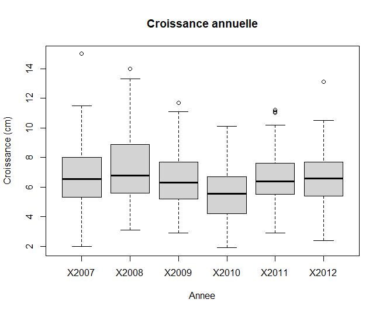

```{r setup, include=FALSE}
knitr::opts_chunk$set(echo = FALSE)
```

*Ce tutoriel est adapté de [Basic data manipulation](https://ourcodingclub.github.io/tutorials/data-manip-intro/index.html) du site [Our Coding Club](https://ourcodingclub.github.io/).* 

# Introduction

```{r, layout="l-body-outset"}
knitr::include_graphics("img/data_cowboy.png")
```
Dessin de [Allison Horst](https://raw.githubusercontent.com/allisonhorst/stats-illustrations/master/rstats-artwork/data_cowboy.png)

<br>

Les formats de nos données peuvent varier, et un format utile et pratique dans un cas précis ne le sera pas forcément pour un autre. La maîtrise des outils de manipulation et de mise en forme des données est donc essentielle !

Les **objectifs** de ce tutoriel sont les suivants :  

1. Utiliser la `syntaxe R basique` pour manipuler des données
2. Utiliser les outils du package `dplyr` pour manipuler des données  
3. Mettre en forme des données à l'aide du package `tidyr`

Voici les **étapes** que nous allons suivre pour y parvenir :  
<br>

1. [Utiliser la syntaxe R basique pour manipuler des données](#basic)  
2. [Exploiter les outils du Tidyverse pour manipuler des données](#tidyverse) :  
    - [Explorer les principales fonctions de `dplyr`](#dplyr) : [`rename()`](#rename), [`filter()`](#filter),                 [`select()`](#select), [`arrange()`](#arrange), [`mutate()`](#mutate), [`group_by()`](#groupby),                        [`summarise()`](#summarise), [`join()`](#join)  
    - [Mettre en forme des données à l'aide du package `tidyr`](#tidyr) : [`pivot_longer()`](#pivotlonger),                   [`pivot_wider()`](#pivotwider)  
3. [Défi](#defi)

<br>

Vous pouvez revoir les bases de R et RStudio dans le tutoriel [Premiers pas avec R](https://codons.netlify.app/posts/premiers-pas-avec-r/).

<br>

## Importer les données

Ouvrez un nouveau script et importez le jeu de données `croissance.csv`. Il s'agit d'un tableau contenant des mesures de croissance annuelle de tiges d'arbrisseaux (*Empetrum nigrum* ou camarine noire) qui poussent dans des dunes de sable. Ces arbrisseaux sont situés dans des zones, allant de la plus proche (2) à la plus éloignée (7) de la mer.

```{r, out.width="100%"}

```
[*Empetrum nigrum* ou camarine noire](https://fr.wikipedia.org/wiki/Empetrum_nigrum)

```{r, echo=TRUE, eval=FALSE}
# Ateliers codons!
# 02 - Manipulation de donnees
# Lundi 30/05/2022

# Definir le repertoire de travail

setwd("C-02-ManipulationDonnees")

# Importer le jeu de donnees

croissance <- read.csv("https://raw.githubusercontent.com/codons-blog/C-02-ManipulationDonneesBases/main/croissance.csv")

# Explorer les donnees

head(croissance)  # affiche les premieres lignes
str(croissance)  # types des variables
croissance$Indiv  # individus
length(unique(croissance$Indiv))  # nombre d'individus
```

# Manipulation de données à l'aide de la syntaxe R basique {#basic}

Vous pouvez sélectionner une partie des données à l'aide des crochets `[ , ]` : le chiffre à gauche de la virgule désigne les lignes et le chiffre à droite les colonnes. Un espace vide à gauche ou à droite de la virgule permet de sélectionner respectivement toutes les lignes ou toutes les colonnes.

```{r, echo=TRUE, eval=FALSE}
# Selectionner une partie des donnees

croissance[2, 5]  # 2e ligne, 5e colonne
croissance[6, ]  # 6e ligne
croissance[6, ]$Indiv  # 6e ligne de la variable Indiv
croissance[croissance$Indiv == 603, ]  # individu n°603
```

### Les opérateurs logiques

Voici les opérateurs les plus fréquemment utilisés pour sélectionner des données : 

Opérateur   Expression logique
----------  -------------------
==          strictement égal à
<=          inférieur ou égal à
<           inférieur à
>=          supérieur ou égal à
>           supérieur à
!=          différent de
%in%        appartient à
&           ET
|           OU
!           PAS  

Voyons comment les utiliser : 

```{r, echo=TRUE, eval=FALSE}
# Une seule condition

croissance[croissance$Zone < 4, ]  # zones 2 et 3
croissance[croissance$Zone <= 4, ]  # zones 2, 3 et 4
croissance[!croissance$Zone >= 5, ]  # zones 2, 3 et 4

# Deux conditions

croissance[croissance$Zone == 2 | croissance$Zone == 7, ]  # zones 2 et 7
croissance[croissance$Zone == 2 & croissance$Indiv %in% c(300:400), ]  # zone 2, identifiants entre 300 et 400
```

### Construction de séquences

Dans la dernière commande, la fonction `c(300:400)` permet de sélectionner les individus ayant des identifiants entre 300 et 400. Il existe d'autres façons de construire une séquence :  

- `seq(300, 400, 10)` : de 300 à 400 par incrément de 10  
  
- `rep(c(1, 2), 3)` : `1 2` répété 3 fois

<aside>
Que donnera `rep(seq(0, 30, 10), 4)` ?
</aside>

### Modifier des donnees

Lorsqu'on manipule des données, il est préférable de créer une **copie de travail** de l'objet d'origine pour ne pas l'écraser.

```{r, echo=TRUE, eval=FALSE}
# Creer une copie de travail de l'objet d'origine

croissance2 <- croissance

# Modifier des noms de colonnes

names(croissance2)[1] <- "zone"  # 1e colonne
names(croissance2)[2] <- "ID"  # 2e colonne

# Modifier une valeur

croissance2[1, 4] <- 5.7  # remplace la valeur dans la 1e ligne, 4e colonne par 5.7
croissance2[croissance2$ID == 373, ]$X2008 <- 5.7  # meme chose avec des operateurs logiques

# Creer un facteur
str(croissance2)  # types de variables
croissance2$zone <- as.factor(croissance2$zone)  # definir la variable zone comme facteur
str(croissance2)  # verification

# Modifier les niveaux d'un facteur
levels(croissance2$zone)  # affiche les niveaux de la variable
levels(croissance2$zone) <- c("A", "B", "C", "D", "E", "F")
```

# Manipuler des données à l'aide du Tidyverse {#tidyverse}

Le [**Tidyverse**](https://www.tidyverse.org/) est un ensemble de packages permettant notamment d'**importer des données (`readr`)**, de les **manipuler (`dplyr` et `tidyr`)**, de créer des **graphiques (`ggplot2`)**, de **manipuler des chaînes de caractères (`stringr`)**, ... 

## Les principales fonctions de `dplyr()` {#dplyr}

Les fonctions du package [`dplyr`](https://dplyr.tidyverse.org/) sont nommées d'après l'action qu'elles accomplissent, ce qui les rend plutôt intuitives.

Commençons par installer et charger le package `dplyr` : 

```{r, echo=TRUE, eval=FALSE}
# Installer le package dplyr
install.packages("dplyr")

# Charger le package dplyr
library(dplyr)
```

Nous aurions également pu installer la suite `tidyverse` : `install.packages("tidyverse")`.

### Renommer des variables avec `rename()` {#rename}

Cette fonction s'utilise de la façon suivante : `rename(objet, nouveau_nom = ancien_nom)`.

```{r, echo=TRUE, eval=FALSE}
# Supprimer les majuscules dans les noms de colonnes
croissance2 <- rename(croissance,
                      zone = Zone,
                      indiv = Indiv)
```

### Filtrer des données avec `filter()` {#filter}

Cette fonction permet de sélectionner des lignes à l'aide d'opérateurs logiques :

```{r, echo=TRUE, eval=FALSE}
# Conserver les observations pour les zones 2 et 3 et les individus dont les identifiants sont compris entre 350 et 450

croissance2_filtre <- filter(croissance2,
                             zone %in% c(2, 3),
                             indiv %in% c(350:450))

# Autre possibilité avec la fonction between()

croissance2_filtre <- filter(croissance2,
                             zone %in% c(2, 3),
                             between(indiv, 350, 450))
```

### Sélectionner des colonnes avec `select()` {#select}

Alors que `filter()` permet de sélectionner des lignes, `select()` permet de sélectionner des colonnes : 

```{r, echo=TRUE, eval=FALSE}
# Conserver ou supprimer des colonnes

croissance2_selection <- select(croissance2,
                                indiv, X2007:X2012)  # conserver des colonnes

croissance2_selection <- select(croissance2,
                                -zone)  # supprimer une colonne

```

La fonction `select()` permet également de renommer des colonnes et d'en modifier l'ordre : 

```{r, echo=TRUE, eval=FALSE}
# Renommer et modifier l'ordre de colonnes

croissance2_selection <- select(croissance2,
                                ID = indiv, zone, X2007:X2012)

# Avec la fonction everything()
croissance2_selection <- select(croissance2,
                                ID = indiv, everything())
```

### Trier des données avec `arrange()` {#arrange}

```{r, echo=TRUE, eval=FALSE}
# Trier par ordre croissant sur l'annee 2007

croissance2_tri <- arrange(croissance2,
                           X2007)

# Trier par ordre decroissant sur l'annee 2008

croissance2_tri <- arrange(croissance2,
                           desc(X2007))
```

### Créer de nouvelles colonnes avec `mutate()` {#mutate}

La fonction `mutate()` permet de créer un nouvelle colonne, par exemple pour effectuer une opération sur plusieurs colonnes, en choisissant le nom de cette nouvelle colonne :

```{r, echo=TRUE, eval=FALSE}
# Calculer la croissance totale pour chaque individu entre 2007 et 2012
croissance2_totale <- mutate(croissance2,
                            croissance.totale = X2007 + X2008 + X2009 + X2010 + X2011 + X2012)

```

La fonction `transmute()` crée une nouvelle colonne mais supprime toutes les autres colonnes.

#### Définir des groupes avec `group_by()` {#groupby}

La fonction `group_by()` permet de définir des groupes dans nos données : 

```{r, echo=TRUE, eval=FALSE}
# Grouper par zone

croissance2_groupes <- group_by(croissance2, zone)
```

Si vous comparez les deux objets `croissance2` et `croissance2_groupes`, vous ne verrez aucune différence, si ce n'est la mention `Groups` quand vous affichez l'objet `croissance2_groupes`. Les groupes créés sont sous-jacents, jusqu'à ce qu'on applique une autre fonction à ces groupes. 

#### Agréger des lignes avec `summarise()` {#summarise}

La fonction `summarise()` permet d'agréger des lignes en appliquant une fonction sur une ou plusieurs colonnes :

```{r, echo=TRUE, eval=FALSE}
# Croissance totale pour l'ensemble des individus pour l'annee 2007

synthese1 <- summarise(croissance2, croisance.2007 = sum(X2007))

# Croissance totale pour l'ensemble des individus groupes par zone pour l'annee 2007
synthese2 <- summarise(croissance2_groupes, croissance.2007 = sum(X2007))
```

Les données étant agrégées, le tableau de sortie sera plus court que les données d'origine.

Vous pouvez utiliser cette fonction pour calculer différentes statistiques sur vos données : 

```{r, echo=TRUE, eval=FALSE}
synthese3 <- summarise(croissance2_groupes,
                       croissance.totale.2007 = sum(X2007),
                       croissance.moyenne.2007 = mean(X2007),
                       croissance.ecart.type.2007 = sd(X2007))
```

#### Joindre des données avec `..._join()` {#join}

Il peut arriver que des données concernant un même projet se trouvent dans plusieurs fichiers (par exemple un fichier avec des mesures sur différents sites, et un autre fichier avec des données climatiques pour ces différents sites).
Les fonctions `..._join()` permettent de joindre plusieurs jeux de données.

Le fichier `traitements.csv` contient des informations sur des traitements appliqués aux plantes : températe (T), fertilisation (F), température + fertilisation (TF), ou contrôle (C).

```{r, echo=TRUE, eval=FALSE}
# Importer le jeu de données (attention : utilisation de read.csv2)
traitements <- read.csv2("https://raw.githubusercontent.com/codons-blog/C-02-ManipulationDonnees/main/traitements.csv")
```

Il existe différents manières de joindre des données, selon ce qu'on souhaite faire des données qui ne sont pas partagées par les jeux de données. Nous allons utiliser la fonction `left_join()` pour garder toutes les données présentes dans `croissance2` et y ajouter les données présentes dans `traitements` : 

```{r, echo=TRUE, eval=FALSE}
# Joindre deux jeux de données

expe <- left_join(croissance2, traitements,
                  by = c("zone" = "Zone",
                         "indiv" = "Indiv"))

```

Les noms des deux colonnes communes aux deux jeux de données diffèrent, nous précisons donc les équivalences dans l'argument `by()`. Si les noms avaient été strictement identiques, nous aurions pu nous passer de cet argument.

Nous pouvons générer un boxplot pour vérifier si les traitements ont eu un effet sur la croissance de nos plantes en 2012 : 

```{r, echo=TRUE, eval=FALSE}
# Effet des traitements sur la croissance en 2012

boxplot(X2012 ~ Traitement, data = expe,
        main = "Effet de la température (T) et de la fertilisation (F)\nsur la croissance",
        ylab = "Croissance totale en 2012")

```

Le code `\n` dans l'argument `main` permet de répartir le titre du graphique sur deux lignes.

```{r, layout="l-body-outset"}
knitr::include_graphics("img/boxplot.png")
```

# Mettre en forme des données à l'aide de `tidyr` {#tidyr}

La façon dont nous récoltons des données sur le terrain ou au laboratoire peut être très différente du format que nous aimerions utiliser dans R. Lors d'une expérimentation, nous préférons utiliser des tableaux préparés à l'avance, à remplir au fur et à mesure. Par exemple, pour suivre la hauteur de semis soumis à différents traitements, nous pourrions utiliser un tableau similaire à celui-ci :  

```{r, layout="l-body-outset"}
knitr::include_graphics("img/tidy_data_1.png")
```

Ce tableau, pratique à remplir, n'est pas idéal pour une analyse (8 mesures par ligne). 

Il est préférable d'utiliser des données au format dit **"tidy"** :  

- chaque ligne représente une observation  
- chaque colonne contient une variable  

Dans le cas présent, les mêmes données au format tidy ressembleraient à ceci : 

```{r, layout="l-body-outset"}
knitr::include_graphics("img/tidy_data_2.png")
```

Ce format facilite les analyses en permettant les comparaisons entre groupes, traitements, espèces, ...

Le jeu de données que nous avons utilisé dans ce tutoriel, `croissance` n'est pas dans un format tidy : la même variable, la mesure de croissance, est répartie sur plusieurs colonnes représentant les années.

Le package `tidyr` permet de jongler entre un format large et un format long, grâce aux fonctions `pivot_...()`.

Commençons par installer et charger le package : 

```{r, echo=TRUE, eval=FALSE}
# Installer le package tidyr

install.packages("tidyr")

# Charger le package

library(tidyr)
```

## Format long avec `pivot_longer()`

La fonction `pivot_longer()` permet de passer d'un format large à un format long. La syntaxe est un peu plus complexe que les fonctions que nous avons vues jusqu'à présent, car il nous préciser quelles colonnes vont être regroupées : 

```{r, echo=TRUE, eval=FALSE}
# Format large -> format long

croissance_long <- pivot_longer(croissance,  # objet a transformer
                                cols = c(X2007:X2012),  # colonnes a regrouper
                                names_to = "Annee",  # nom de la colonne contenant les noms des colonnes regroupees
                                values_to = "Croissance")  # nom de la colonne contenant les valeurs
```

Ce format long permet de visualiser facilement la croissance annuelle en fonction de l'annee : 

```{r, echo=TRUE, eval=FALSE}
# Boxplot de la croissance par annee

boxplot(Croissance ~ Annee,
        data = croissance_long,
        main = "Croissance annuelle",
        ylab = "Croissance (cm)")

```

```{r, layout="l-body-outset"}

```

## Format large avec `pivot_wider()`

La fonction `pivot_wider()` effectue l'opération inverse : 

```{r, echo=TRUE, eval=FALSE}
# Format long -> format large

croissance_large <- pivot_wider(croissance_long,
                                names_from = Annee,  
                                values_from = Croissance)
```

# Défi {#defi}

Mettons en pratique ce que nous avons vu dans ce tutoriel pour tenter de répondre à la question suivante : quelle est l'effet de différentes épices sur la taille des flammes crachées par trois espèces de dragons ?

Commençons par importer les données : 

```{r, echo=TRUE, eval=FALSE}
dragons <- read.csv("https://raw.githubusercontent.com/codons-blog/C-02-ManipulationDonnees/main/dragons.csv")
```

Voici les objectifs : 

- mettre en forme les données (format tidy)  
- créer un boxplot pour chaque espèce montrant l'effet des épices sur la taille des flammes

Malheureusement, vous apprenez que votre assistant a été peu scrupuleux lors de la collecte des données, et il vous faut corriger les erreurs suivantes : 

- la quatrième épice n'était pas du paprika, mais du curcuma  
- l'appareil de mesure était mal calibré lors du traitement au tabasco, mais seulement pour les Magyar à pointes : les mesures sont plus longues de 30 cm que la réalité  
- les tailles sont données en centimètres, alors qu'elles devraient être en mètres.

```{r, echo=TRUE, eval=FALSE, collapse=TRUE}
# Importer les données

dragons <- read.csv("https://raw.githubusercontent.com/codons-blog/C-02-ManipulationDonnees/main/dragons.csv")
```


