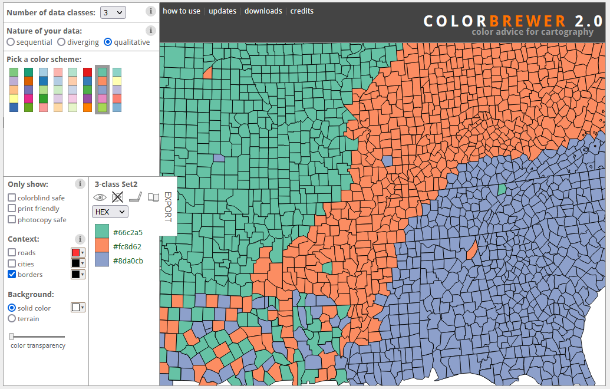
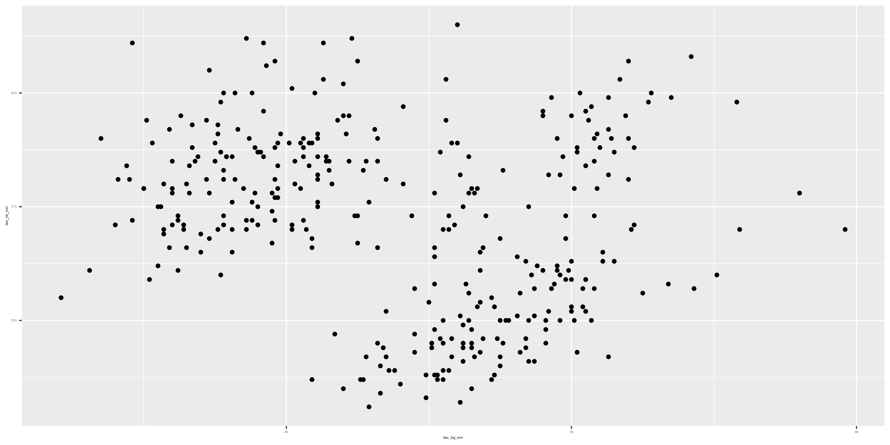

```{r setup, include=FALSE}
knitr::opts_chunk$set(echo = FALSE)
```

# Introduction

```{r, layout="l-body"}
knitr::include_graphics("img/ggplot2_blank.png")
```
Dessin de [Allison Horst](https://github.com/allisonhorst/stats-illustrations/blob/master/rstats-blanks/ggplot2_blank.png)

<br>

Nous avons vu comment [importer nos données dans RStudio](https://codons.netlify.app/posts/premiers-pas-avec-r/), et comment [les manipuler et les mettre en forme](https://codons.netlify.app/posts/manipuler-donnees-tidyverse/).  

<br>

Dans ce tutoriel nous allons voir comment communiquer les résultats de nos analyses - à l'aide de la **visualisation de données** :

<br>

**1. [Construire un graphique *ggplot2*](#construction)**  

**3. [Créer des graphiques basiques avec *ggplot2*](#creer)** :  

- [nuage de points (scatter plot)](#scatterplot) 

- [histogramme](#histogram)  
  
- [boîtes à moustaches (box plot)](#boxplot)  
  
- [diagramme en bâtons (bar plot)](#barplot)  

- [graphiques multiples (facet)](#facet)

**3. [Exporter un graphique](#exporter)**

**4. [Améliorer ses graphiques](#ameliorer)**

**5. [Assembler ses graphiques à l'aide de `patchwork`](#patchwork)**

**6. [Défi](#defi)**

<br> 

# Construire un graphique `ggplot2` {#construire}

Le package `ggplot2` (qui fait partie de la suite Tidyverse) repose sur le principe de **grammaire des graphiques** : notre visualisation se construit étape par étape, en procédant par **couches**, comme le montre la figure ci-dessous.

```{r, layout="l-body"}
knitr::include_graphics("img/ggplot-grammar-of-graphics.png")
```
Figure tirée de [ggplot2 et la grammaire des graphiques](https://larmarange.github.io/analyse-R/ggplot2.html)

<br>

Toutes ces couches ne sont pas nécessaires à la construction d'un graphique.  
La figure ci-dessous montre de manière simplifiée comment créer un `ggplot` basique : 

**1) `ggplot()`** : initialisation de l'outil graphique  

**2) `aes()`** : paramètres esthétiques (répartition des variables sur les axes, couleurs, ...)  

**3) `geom()`** : type de représentation (points, lignes, ...)  

**4) `theme()`** : apparence du graphique (arrière-plan, taille et alignement du texte, ...)

```{r, layout="l-page"}
knitr::include_graphics("img/ggplot_01.gif")
```

# Créer des graphiques avec *ggplot2* {#creer}

Nous allons maintenant voir comment créer les principaux types de graphiques à l'aide de `ggplot2`.  

## Importer les données

```{r, eval=FALSE, echo=TRUE, message=FALSE, warning=FALSE}
# Ateliers codons!
# 03 - visualisation de donnees
# 2022-06-30

# Charger le Tidyverse
library(tidyverse)

# Definir l'espace de travail
setwd("C-04-VisualisationDonnees")

# Importer les donnees
pingouins <- readr::read_csv("https://raw.githubusercontent.com/codons-blog/C-04-VisualisationDonnees/main/data/pingouins.csv")
```

## Histogramme {#hist}

Créons un histogramme basique. Un graphique `ggplot2` se crée toujours par couches :  

1. Initialisation de l'outil graphique (`ggplot()`)  
2. Paramètres esthétiques (`aes()`)  
3. Type de graphique `geom_histogram()`

```{r, echo=TRUE, eval=FALSE}
ggplot(data = pingouins,
       aes(x = aile_lng_mm)) +
  geom_histogram()
```

<aside>
```{r, layout="l-body-outset"}
knitr::include_graphics("img/hist1.png")
```
</aside>

<br>

Nous pouvons modifier les couleurs du graphiques à l'aide des paramètres `colour = "..."` (contour des barres) et `fill = "..."` (intérieur des barres) : 

```{r, echo=TRUE, eval=FALSE}
ggplot(data = pingouins,
       aes(x = aile_lng_mm)) +
  geom_histogram(colour = "blue", fill = "white")
```

<aside>
```{r, layout="l-body-outset"}
knitr::include_graphics("img/hist2.png")
```
</aside>

<br>

La distribution des longueurs d'ailes dépend-elle de l'espèce ? Une façon de le vérifier rapidement serait d'utiliser une couleur par espèce. Pour cela, nous utilisons `fill = espece` au sein de la parenthèse `aes()`.  

Il existe deux façons d'utiliser des couleurs :  

- une seule couleur pour l'ensemble des données : geom_...(colour = "...", fill = "...")  

- différentes couleurs en fonction d'une variable : aes(colour = var)  

En dehors de la parenthèse `aes()` (pour que cela s'applique à l'ensemble des données), nous précisons deux paramètres :  

- `position = "identity"` : il existe différentes manières de positionner les barres d'un histogramme les unes par rapport aux autres.  

- `alpha = 0.5` : permet de régler la transparence (entre 0 et 1, par opacité croissante)

```{r, echo=TRUE, eval=FALSE}
ggplot(data = pingouins,
              aes(x = aile_lng_mm)) +
    geom_histogram(aes(fill = espece),
                   position = "identity",
                   alpha = 0.5)
```

<aside>
```{r, layout="l-body-outset"}
knitr::include_graphics("img/hist3.png")
```
</aside>

<br>

Le paramètre `scale_fill_brewer()` permet de sélectionner d'autres palettes proposées par l'outil [ColorBrewer 2.0](https://colorbrewer2.org/#type=qualitative&scheme=Set2&n=3).  

```{r, layout="l-body-outset"}

```

<br>

Il existe des packages proposant de très nombreuses palettes supplémentaires ([voir cette liste](https://github.com/EmilHvitfeldt/r-color-palettes)).

<br>

Nous utilisons la palette **Set2** : 

```{r, echo=TRUE, eval=FALSE}
ggplot(data = pingouins,
              aes(x = aile_lng_mm)) +
    geom_histogram(aes(fill = espece),
                   position = "identity",
                   alpha = 0.5) +
  scale_fill_brewer(palette = "Set2")
```

<aside>
```{r, layout="l-body"}
knitr::include_graphics("img/hist4.png")
```
</aside>

<br>

Nous pouvons également définir les couleurs à l'aide de `scale_fill_manual()` : 

```{r, echo=TRUE, eval=FALSE}
ggplot(data = pingouins,
              aes(x = aile_lng_mm)) +
    geom_histogram(aes(fill = espece),
                   position = "identity",
                   alpha = 0.5) +
  scale_fill_manual(values = c("darkorange", "purple", "cyan4"))
```

<aside>
```{r, layout="l-body"}
knitr::include_graphics("img/hist5.png")
```
</aside>

<br>

Le paramètre `labs()` permet d'ajouter ou de modifier les titres du graphique et des axes : 

```{r, echo=TRUE, eval=FALSE}
ggplot(data = pingouins,
              aes(x = aile_lng_mm)) +
    geom_histogram(aes(fill = espece),
                   position = "identity",
                   alpha = 0.5) +
  scale_fill_manual(values = c("darkorange", "purple", "cyan4"))
  labs(title = "Longueur des ailes pour trois espèces de pingouins",
       subtitle = "Sur trois iles de l'archipel Palmer (Antarctique)",
       x = "Longueur des ailes (mm)",
       y = "Frequence")
```

<aside>
```{r, layout="l-body-outset"}
knitr::include_graphics("img/hist6.png")
```
</aside>

<br>

Pour finir, nous pouvons modifier le **"thème"**, c'est-à-dire l'apparence générale de notre graphique, en choisissant parmi les thèmes prédéfinis : `theme_grey` (par défaut), `theme_bw()`, `theme_minimal()`, ...

 
```{r, echo=TRUE, eval=FALSE}
ggplot(data = pingouins,
              aes(x = aile_lng_mm)) +
    geom_histogram(aes(fill = espece),
                   position = "identity",
                   alpha = 0.5) +
  scale_fill_manual(values = c("darkorange", "purple", "cyan4"))
  labs(title = "Longueur des ailes pour trois espèces de pingouins",
       subtitle = "Sur trois iles de l'archipel Palmer (Antarctique)",
       x = "Longueur des ailes (mm)",
       y = "Frequence") +
    theme_minimal()
```

<aside>
```{r, layout="l-body-outset"}
knitr::include_graphics("img/hist7.png")
```
</aside>

<br>

La figure ci-dessous vous montre l'effet de chaque ligne de code sur l'apparence du graphique : 

```{r, layout="l-page"}
knitr::include_graphics("img/ggplot_02.gif")
```

<br>

## Nuage de points (scatter plot) {#scatterplot}

Le paramètre `geom_point()` permet de générer un nuage de points : 

```{r, echo=TRUE, eval=FALSE}
ggplot(data = pingouins,
       aes(x = bec_lng_mm, y = bec_htr_mm)) +
  geom_point()
```

<aside>
```{r, layout="l-body-outset"}

```
</aside>

<br>

Comme nous l'avons fait avec l'histogramme, nous allons personnaliser ce nuage de points. La taille et la forme des points peuvent être modifiées à l'aide des paramètres `size` et `shape`.

Comme pour la couleur, il existe deux façons d'utiliser ces paramètres :

- à l'intérieur d'une parenthèse `aes()` pour appliquer le paramètre en fonction d'une variable  

- à l'extérieur d'une parenthèse `aes()` pour appliquer le paramètre à tous les points  

Il existe un code numérique permettant de définir la forme des points : 

```{r, layout="l-body"}
knitr::include_graphics("img/geom_point_shapes.png")
```
[ggplot2 Aesthetic specifications](https://ggplot2.tidyverse.org/articles/ggplot2-specs.html)

Ces 25 formes permettent différentes modifications de la couleur : 

- Formes 0 à 14 : contour (`colour = "..."`)  

- Formes 15 à 20 : intérieur (`colour = "..."`)  

- Formes 21 à 24 : contour (`colour = "..."`) et intérieur (`fill = "..."`). Pour ces 5 formes, l'épaisseur du contour peut être ajustée à l'aide du paramètre `stroke = 1.5` par exemple.

<br>

Le paramètre `size()`, placé en dehors d'une parenthèse `aes()`, prend une valeur numérique entre 0 et 25. Placé dans une parenthèse `aes()`, il permet par exemple de modifier la taille des points en fonction d'une autre variable de notre jeu de donénes.