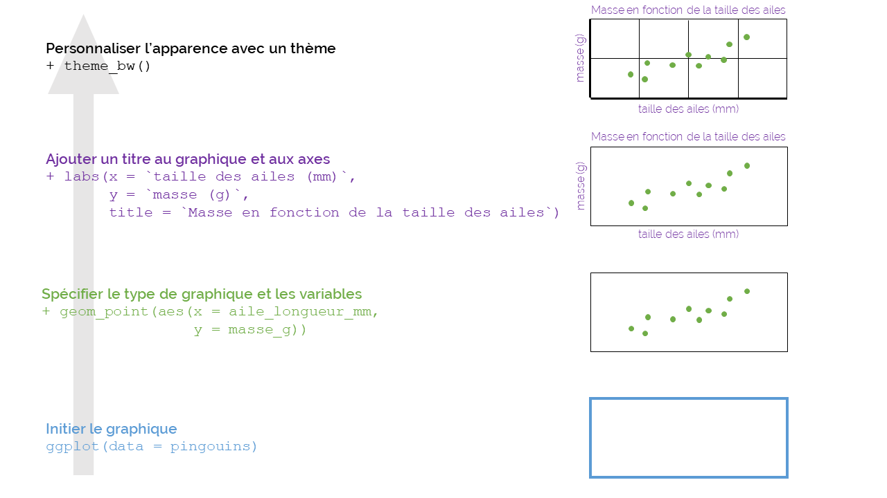

```{r setup, include=FALSE}
knitr::opts_chunk$set(echo = FALSE)
```

*Ce tutoriel est adapté de [Beautiful and informative data visualisation](https://ourcodingclub.github.io/tutorials/datavis/) et [Data visualisation 2](https://ourcodingclub.github.io/tutorials/data-vis-2/) du site [Our Coding Club](https://ourcodingclub.github.io/).*  

# Introduction

```{r, layout="l-body"}
knitr::include_graphics("img/ggplot2_blank.png")
```
Dessin de [Allison Horst](https://github.com/allisonhorst/stats-illustrations/blob/master/rstats-blanks/ggplot2_blank.png)

<br>

Nous avons vu comment [importer nos données dans RStudio](https://codons.netlify.app/posts/premiers-pas-avec-r/), et comment [les manipuler et les mettre en forme](https://codons.netlify.app/posts/manipuler-donnees-tidyverse/).  
Nous allons maintenant voir comment communiquer les résultats de nos analyses - à l'aide de la **visualisation de données**.  

<br>

Voici les objectifs et le sommaire de ce tutoriel :  

<br>

**1. [Se familiariser avec la syntaxe *ggplot2*](#syntaxe)**  

**2. [Choisir le bon type de graphique](#type)**  

**3. [Créer des graphiques avec *ggplot2*](#creer)** :  

- [histogramme](#hist)  
  
- [scatter plot](#scatterplot)  
  
- [box plot](#boxplot)  
  
- [bar plot](#barplot)  

**4. [Arranger plusieurs graphiques et les exporter](#panels)**

**5. [Défi](#defi)**

<br> 

# La syntaxe `ggplot2` {#syntaxe}

Avant d'attaquer la syntaxe `ggplot2`, voyons brièvement ce que de bons graphiques ont en commun : 

Etape       Description                                   Notes
----------  -------------------                           -------------------
1           Un graphique adapté aux résultats             boxplot, scatterplot, régression linéaire, ...
2           Un graphique bien organisé                    variable indépendante (explicative) sur l'axe x et variable dépendante (réponse) sur l'axe y 
3           Les axes x et y utilisent les bonnes unités   les symboles appropriés (alpha, beta, ... ) et des exposants/indices quand nécessaire
4           Les axes x et y sont facilement lisibles      attention aux polices originales et aux lettres trop petites  
5           Une légende claire et informative             on différencie facilement les points/lignes
6           Un graphique aéré                             ne pas mettre tous les résultats sur un seul graphique, les espacer
7           Un choix de couleurs clair et cohérent        utiliser les mêmes couleurs pour les mêmes variables, éviter les combinaisons vert/rouge difficiles à distinguer pour certaines personnes
8           Un graphique aux bonnes dimensions            éviter les superpositions d'étiquettes ou de points/lignes, ajuster la hauteur ou la largeur du graphique si nécessaire
9           Des mesures d'incertitude quand nécessaire    barres d'erreur, intervalles de confiance, en précisant ce dont il s'agit
10          Un texte concis et informatif                 préciser ce que les points représentent (données brutes ? modèles de prédiction ?), quelle est la taille de l'échantillon pour chaque traitement, ...

<br>

Le package `ggplot2` est très utile pour vous guider dans ces étapes. Le `gg` de `ggplot2` signifie **"grammaire des graphiques"**. L'écriture du code de votre graphique ressemblera à la construction d'une phrase avec différentes parties s'articulant logiquement. De façon shématique, il s'agit d'ajouter des couches qui contiennent les différents éléments de votre graphique. Vous commencez par créer un graphique vide, puis ajoutez une couche avec vos points, puis une couche avec les mesures d'incertitude, les axes, etc.

```{r, layout="l-body-outset"}

```

```{r, layout="l-body-outset"}
knitr::include_graphics("img/ggplot_01.gif")
```