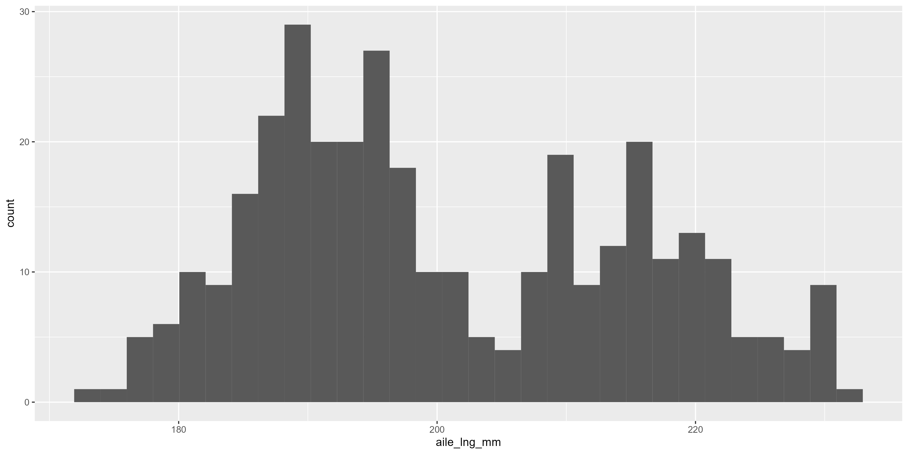
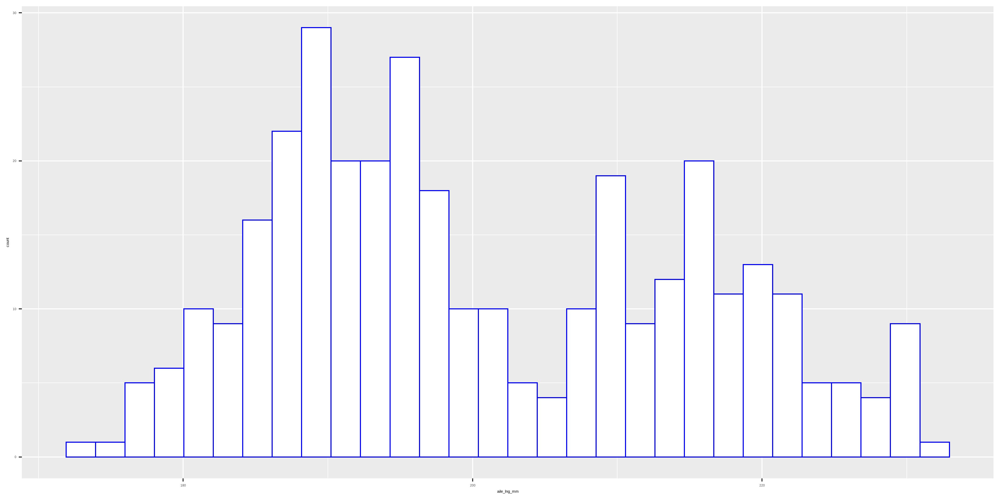
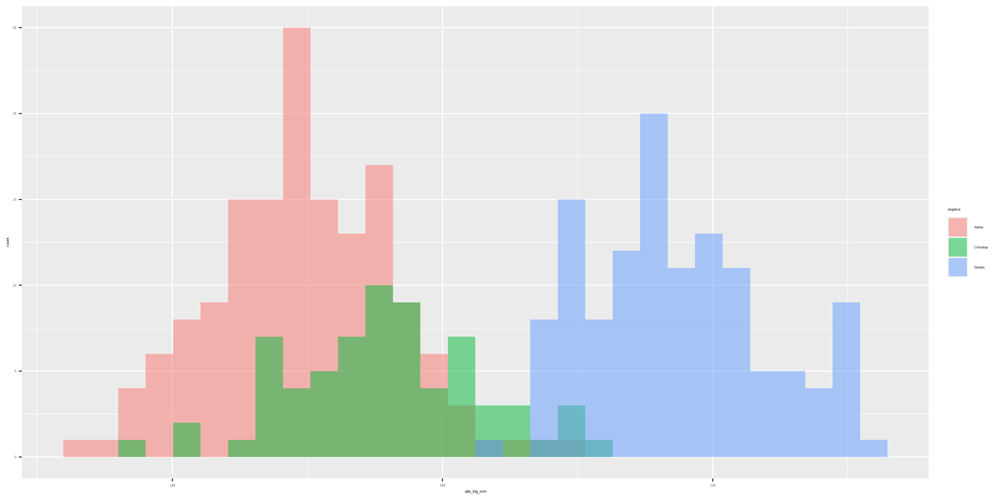
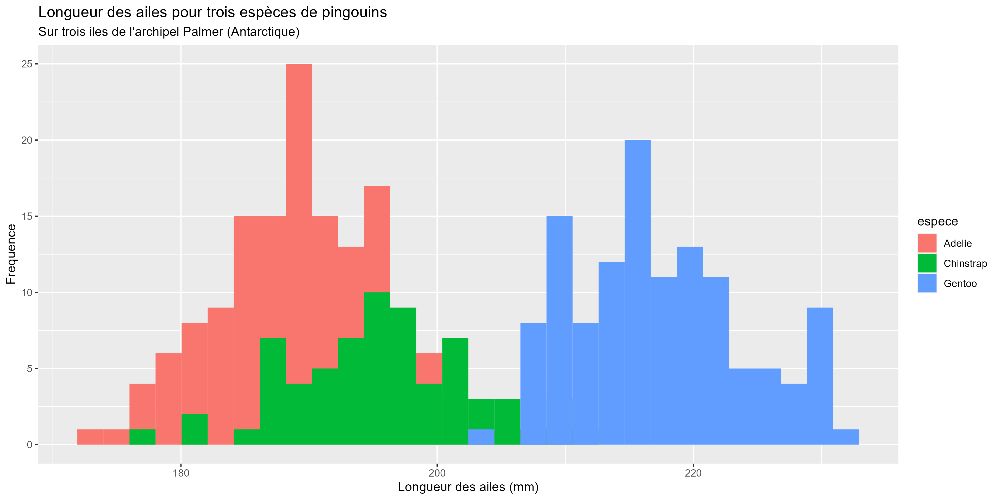
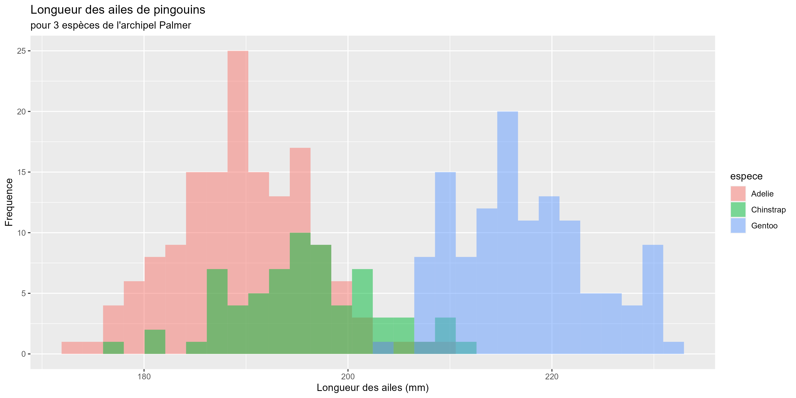
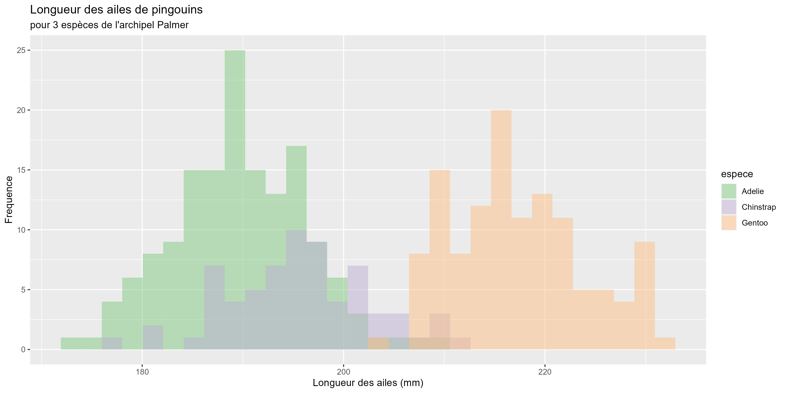
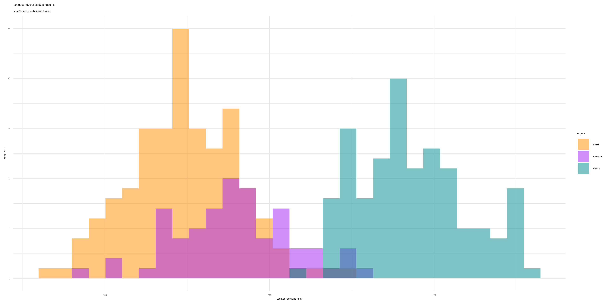
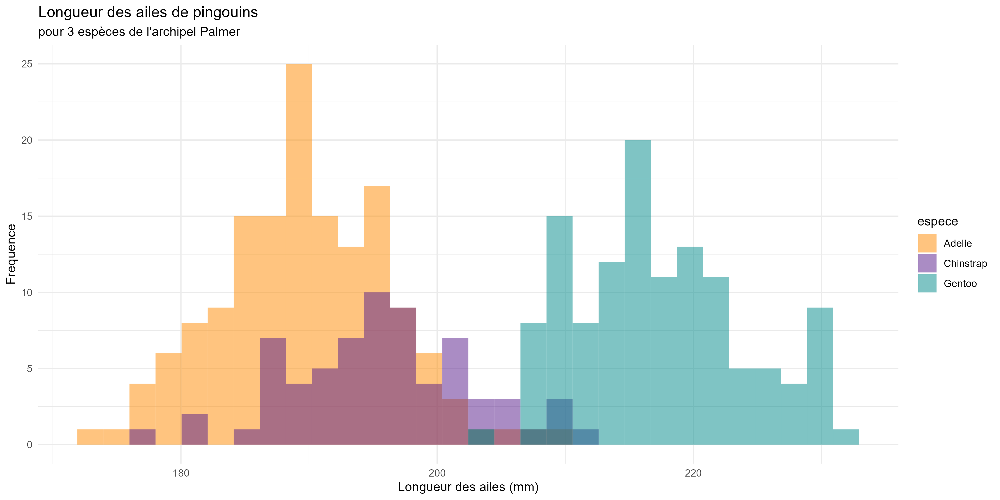

```{r setup, include=FALSE}
knitr::opts_chunk$set(echo = FALSE)
```

*Ce tutoriel est adapté de [Beautiful and informative data visualisation](https://ourcodingclub.github.io/tutorials/datavis/) et [Data visualisation 2](https://ourcodingclub.github.io/tutorials/data-vis-2/) du site [Our Coding Club](https://ourcodingclub.github.io/).*  

# Introduction

```{r, layout="l-body"}
knitr::include_graphics("img/ggplot2_blank.png")
```
Dessin de [Allison Horst](https://github.com/allisonhorst/stats-illustrations/blob/master/rstats-blanks/ggplot2_blank.png)

<br>

Nous avons vu comment [importer nos données dans RStudio](https://codons.netlify.app/posts/premiers-pas-avec-r/), et comment [les manipuler et les mettre en forme](https://codons.netlify.app/posts/manipuler-donnees-tidyverse/).  
Nous allons maintenant voir comment communiquer les résultats de nos analyses - à l'aide de la **visualisation de données**.  

<br>

Voici les objectifs et le sommaire de ce tutoriel :  

<br>

**1. [Se familiariser avec la syntaxe *ggplot2*](#syntaxe)**  

**2. [Choisir le bon type de graphique](#type)**  

**3. [Créer des graphiques avec *ggplot2*](#creer)** :  

- [histogramme](#hist)  
  
- [nuage de points (scatter plot)](#scatterplot)  
  
- [boîtes à moustaches (box plot)](#boxplot)  
  
- [diagramme en bâtons (bar plot)](#barplot)  

**4. [Arranger plusieurs graphiques et les exporter](#panels)**

**5. [Défi](#defi)**

<br> 

# La syntaxe `ggplot2` {#syntaxe}

Avant d'attaquer la syntaxe `ggplot2`, voyons brièvement ce que de bons graphiques ont en commun : 

Etape       Description                                   Notes
----------  -------------------                           -------------------
1           Un graphique adapté aux résultats             boxplot, scatterplot, régression linéaire, ...
2           Un graphique bien organisé                    variable indépendante (explicative) sur l'axe x et variable dépendante (réponse) sur l'axe y 
3           Les axes x et y utilisent les bonnes unités   les symboles appropriés (alpha, beta, ... ) et des exposants/indices quand nécessaire
4           Les axes x et y sont facilement lisibles      attention aux polices originales et aux lettres trop petites  
5           Une légende claire et informative             on différencie facilement les points/lignes
6           Un graphique aéré                             ne pas mettre tous les résultats sur un seul graphique, les espacer
7           Un choix de couleurs clair et cohérent        utiliser les mêmes couleurs pour les mêmes variables, éviter les combinaisons vert/rouge difficiles à distinguer pour certaines personnes
8           Un graphique aux bonnes dimensions            éviter les superpositions d'étiquettes ou de points/lignes, ajuster la hauteur ou la largeur du graphique si nécessaire
9           Des mesures d'incertitude quand nécessaire    barres d'erreur, intervalles de confiance, en précisant ce dont il s'agit
10          Un texte concis et informatif                 préciser ce que les points représentent (données brutes ? modèles de prédiction ?), quelle est la taille de l'échantillon pour chaque traitement, ...

<br>

Le package `ggplot2` est très utile pour vous guider dans ces étapes. Le `gg` de `ggplot2` signifie **"grammaire des graphiques"**.  
L'écriture du code de votre graphique ressemblera à la construction d'une phrase avec différentes parties s'articulant logiquement.  
De façon shématique, il s'agit d'ajouter des couches qui contiennent les différents éléments de votre graphique : vous commencez par créer un graphique vide, puis ajoutez une couche avec vos points, puis une couche avec les axes, etc.

```{r, layout="l-body-outset"}
knitr::include_graphics("img/ggplot-grammar-of-graphics.png")
```
Figure tirée de [ggplot2 et la grammaire des graphiques](https://larmarange.github.io/analyse-R/ggplot2.html)

<br>

Le graphique ci-dessous se décompose en quatre couches :  

1) Initialisation de l'outil graphique **`ggplot()`**  
2) Paramètres esthétiques **`aes()`** : quelle variable ira sur quel axe  
3) **`geom()`** : manière de représenter nos variables (points, lignes, ...)  
4) **`theme_...()`** pour modifier l'apparence du graphique

```{r, layout="l-page"}
knitr::include_graphics("img/ggplot_01.gif")
```

# Créer des graphiques avec *ggplot2* {creer}

Nous allons maintenant voir comment créer les principaux types de graphiques à l'aide de `ggplot2`.  

## Importer les données

```{r, eval=FALSE, echo=TRUE, message=FALSE, warning=FALSE}
# Ateliers codons!
# 03 - visualisation de donnees
# 2022-06-30

# Charger le Tidyverse
library(tidyverse)

# Definir l'espace de travail
setwd("C-04-VisualisationDonnees")

# Importer les donnees
pingouins <- readr::read_csv("https://raw.githubusercontent.com/codons-blog/C-04-VisualisationDonnees/main/data/pingouins.csv")
```

## Histogramme {#hist}

Créons un histogramme basique. Un graphique `ggplot2` se crée toujours par couches : 
1. Initialisation de l'outil graphique (`ggplot()`)  
2. Paramètres esthétiques (`aes()`)  
3. Type de graphique `geom_histogram()`

```{r, echo=TRUE, eval=FALSE}
ggplot(data = pingouins,
       aes(x = aile_lng_mm)) +
  geom_histogram()
```


```{r, layout="l-body-outset"}

```

Nous pouvons modifier les couleurs du graphiques à l'aide des paramètres `colour = "..."` (contour des barres) et `fill = "..."` (intérieur des barres) : 

```{r, echo=TRUE, eval=FALSE}
ggplot(data = pingouins,
       aes(x = aile_lng_mm)) +
  geom_histogram(colour = "blue", fill = "white")
```

```{r, layout="l-body-outset"}

```

Le paramètre `labs()` permet d'ajouter ou de modifier les titres du graphique et des axes : 

```{r, echo=TRUE, eval=FALSE}
ggplot(data = pingouins,
                aes(x = aile_lng_mm)) +
  geom_histogram(colour = "blue", fill = "white") +
  labs(title = "Longueur des ailes pour trois espèces de pingouins",
       subtitle = "Sur trois iles de l'archipel Palmer (Antarctique)",
       x = "Longueur des ailes (mm)",
       y = "Frequence")
```

```{r, layout="l-body-outset"}

```

La distribution des longueurs d'ailes diffère-t-elle en fonction de l'espèce ? Nous pouvons le vérifier en utilisant différentes couleurs pour les différente espèces.  
Pour cela, nous utilisons `fill = espece` au sein de la parenthèse `aes()`. Il existe deux façons de modifier les couleurs d'un graphique :  

- une seule couleur pour l'ensemble des données : geom_...(colour = "...", fill = "...")  
- couleur en fonction d'une variable : aes(colour = var)  

```{r, echo=TRUE, eval=FALSE}
ggplot(data = pingouins,
       aes(x = aile_lng_mm,
           fill = espece)) +
  geom_histogram(position = "identity") +
  labs(title = "Longueur des ailes pour trois espèces de pingouins",
       subtitle = "Sur trois iles de l'archipel Palmer (Antarctique)",
       x = "Longueur des ailes (mm)",
       y = "Frequence")
```

Nous avons ajouté le paramètre position = "identity" dans geom_histogram(). Il existe différentes façons de présenter des histogrammes : `position = "stack"` (par défaut), `position = "identity"`, `position = "dodge"`, ... essayez les différentes options pour voir le résultat.

```{r, layout="l-body-outset"}

```

Certaines barres de notre histogramme ce recouvrent. Nous pouvons utiliser le paramètre `alpha` pour modifier la transparence : 

```{r, echo=TRUE, eval=FALSE}
ggplot(data = pingouins,
       aes(x = aile_lng_mm)) +
  geom_histogram(aes(fill = espece),
                 position = "identity",
                 alpha = 0.5) +
  labs(title = "Longueur des ailes de pingouins",
       subtitle = "pour 3 espèces de l'archipel Palmer",
       x = "Longueur des ailes (mm)",
       y = "Frequence")
```

```{r, layout="l-body-outset"}

```

Nous pouvons choisir une autre palette de couleurs à l'aide du paramètre `scale_fill_brewer()`. Les palettes incluses sont visibles ci-dessous.

```{r, layout="l-body"}
knitr::include_graphics("img/rcolorbrewer.png")
```

Il existe des packages proposant de très nombreuses palettes supplémentaires ([voir cette liste](https://github.com/EmilHvitfeldt/r-color-palettes))

Essayons la palette **Accent** : 

```{r, echo=TRUE, eval=FALSE}
ggplot(data = pingouins,
                aes(x = aile_lng_mm)) +
  geom_histogram(aes(fill = espece),
                 position = "identity",
                 alpha = 0.5) +
  labs(title = "Longueur des ailes de pingouins",
       subtitle = "pour 3 espèces de l'archipel Palmer",
       x = "Longueur des ailes (mm)",
       y = "Frequence") +
  scale_fill_brewer(palette = "Accent")
```

```{r, layout="l-body-outset"}

```

Nous pouvons préciser les couleurs à l'aide de `scale_fill_manual()` : 

```{r, echo=TRUE, eval=FALSE}
ggplot(data = pingouins,
                aes(x = aile_lng_mm)) +
  geom_histogram(aes(fill = espece),
                 position = "identity",
                 alpha = 0.5) +
  labs(title = "Longueur des ailes de pingouins",
       subtitle = "pour 3 espèces de l'archipel Palmer",
       x = "Longueur des ailes (mm)",
       y = "Frequence") +
  scale_fill_manual(values = c("darkorange", "purple4", "cyan4"))
```

```{r, layout="l-body-outset"}

```

Pour finir, nous pouvons modifier le **thème** de notre graphique, c'est-à-dire son apparence générale. Différents thèmes sont disponibles : `theme_grey` (par défaut), `theme_bw()`, `theme_minimal()`, ... essayez-les !

```{r, echo=TRUE, eval=FALSE}
ggplot(data = pingouins,
                aes(x = aile_lng_mm)) +
  geom_histogram(aes(fill = espece),
                 position = "identity",
                 alpha = 0.5) +
  labs(title = "Longueur des ailes de pingouins",
       subtitle = "pour 3 espèces de l'archipel Palmer",
       x = "Longueur des ailes (mm)",
       y = "Frequence") +
  scale_fill_manual(values = c("darkorange", "purple4", "cyan4")) +
  theme_minimal()
```

```{r, layout="l-body-outset"}

```